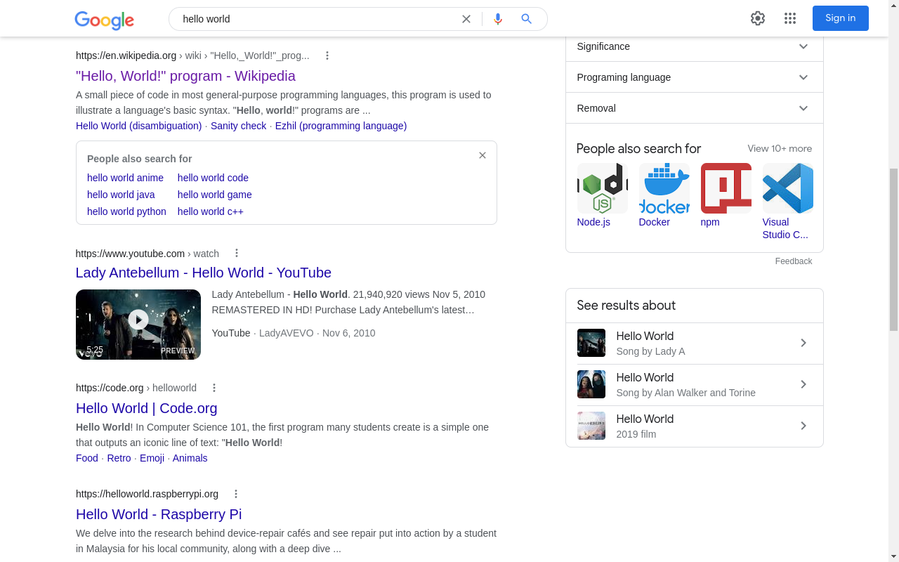

Stop Google Search proxy
===

This add-on works on top of the Google search results page. The basic idea is to eliminate the "extra" hop between clicking on a Google Search result item and loading the desired page. When you are not using this extension, you will see on the monitor tab (developer tools) that Google sends you to a "google.com/url?" page and then to the website you requested.

Classical Google Search result page

The "blue" line on the monitor tab (bottom) is the "extra" hop Google Search adds between clicking and fetching the desired website.

This extension will get rid of the Google Search proxy request! No calls to google.com/url =D