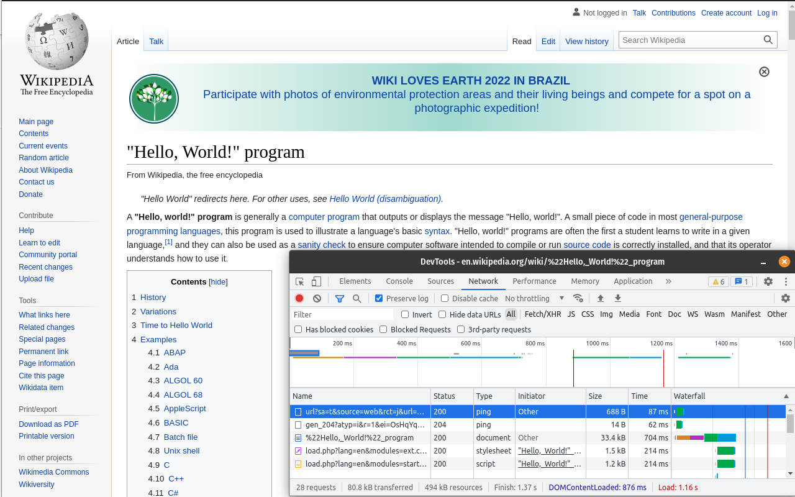

# Stop Google Search proxy

This extension works on top of the Google search results page. The basic idea is to eliminate the additional hop between clicking on a Google Search result item and loading the desired page. When you are not using this extension, you will see on the monitor tab (developer tools) that Google sends you to a "google.com/url" page and then to the website you requested.

Behind the scenes, there are two positive side effects: more privacy (avoiding a tracker, google.com/url) and a faster browsing experience (fewer requests to load a page).

Firefox: https://addons.mozilla.org/en-US/firefox/addon/stop-googlesearch-proxy/

Chrome: https://chrome.google.com/webstore/detail/stop-google-search-proxy/hdjjpkgknpghnfoekbehekdliiljmjld

---

Extension disabled, so there is the extra hop Google Search adds between clicking and fetching the expected website. The blue line on the network monitor tab (bottom) shows this request. 

---

Extension enabled, no calls to google.com/url before loading the expected page =D
